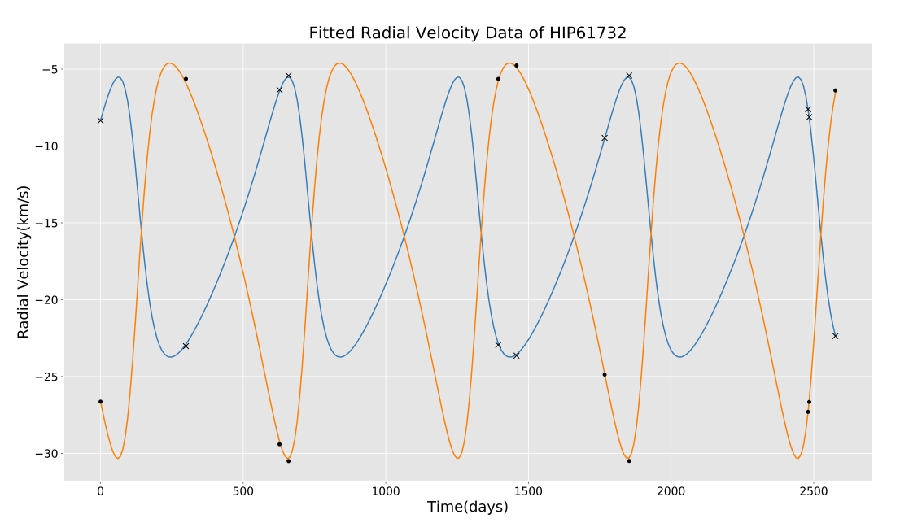

# Inter IIT Tech Meet 9.0 
## Web Based Visualization Tool For Astrosat Observations

### Table of Contents
- [Overview](#overview)
- [Data Cleaning and Preprocessing](#1-data-cleaning-and-preprocessing)
- [Preliminary Spectral Analysis of Spectroscopic Binary HIP-61732](#2-preliminary-spectral-analysis-of-spectroscopic-binary-hip-61732)
- [Project Tree](#project-tree)

### Overview

The repository contains the relevant code and data covering two domains
- The cleaning and processing of data provided in the forms of catalogs A and B, and the publications. The source names have been resolved using SIMBAD and is accurate upto atleast 2 arcmin. Cited sources have been extracted from the publications using regular expressions, which exploit the astro nomencalture to cature the source names from the title and abstracts.
- Use of the available data from one of the thoroughly observed sources to derive meaningful results based on the type of astronomical object being observed.

### 1. Data Cleaning and Preprocessing

#### Content
| Component | Description |
| ---- | --- |
| Catalog-A | Includes script to clean catalog A along with the processed data |
| Catalog-B-Astrosat | Includes script to clean and crossmatch catalog B with A along with the processed data |
| Publications | Includes script to extract sources from publications along with the processed data  |
| Publications_Crossmatch | Includes script to classify and crossmatch the publications with catalog A and B along with the processed data |
| Complete_Catalog.csv | Final processed catalog to feed to the AstroSat Visualiser  |
| requirements.txt | Dependencies (if) required to run the scripts |

#### Requirements
```bash
pandas==1.2.3
astropy==4.2
numpy==1.20.1
astroquery==0.4.1
beautifulsoup4==4.9.3
```

To install all the dependecies in one go, run
```bash
cd Data-Processing
pip install -r requirements.txt
```


### 2. Preliminary Spectral Analysis of Spectroscopic Binary HIP-61732

#### Content
| Component | Description |
| ---- | --- |
| analysis.py | Script to carry out the analysis of the spectroscopic binary  |
| HIP61732-aladin.jpeg | Image of the binary as can be seen on the AstroSat Visualiser |
| HIP61732.csv | Data used for the analysis  |
| Analysis_Report.pdf | Detailed report covering the analysis and the underlying physics and mathematics |
| plot.png | Saved image of matplotlib plot from the analysis  |
| requirements.txt | Dependencies required to run the script |

#### Requirements
```bash
numpy==1.20.1
lmfit==1.0.2
matplotlib==3.3.4
astropy==4.2
```

To install all the dependecies in one go, run
```bash
cd HIP61732-Analysis
pip install -r requirements.txt
```

#### Usage
After navigating into the `HIP61732-Analysis`, simply run
```
python analysis.py
```
Output: 
```bash 
Initial Estimate of Period from the LombScargle (days): 583.8284324893621
Semi Amplitude(km/s); K1: 9.207458315319723
Semi Amplitude(km/s); K2: 13.057301121256861
Time of Periastron passage(days); To: 118.0820701823903
Period(days); P: 595.2145156801245
Systemic Velocity(km/s); Vo: -15.77453053329902
Eccentricity; e: 0.3394044058118484
Argument of Periastron(degs); w: 64.5844448428194
```
</img>


## Project tree


 * [assets](./assets)
   * [isro-logo.jpeg](./assets/isro-logo.jpeg)
   * [plot.png](./assets/plot.png)
 * [Data-Processing](./Data-Processing)
   * [Catalog-A](./Data-Processing/Catalog-A)
     * [Final_Catalog.py](./Data-Processing/Catalog-A/Final_Catalog.py)
     * [Hcat.csv](./Data-Processing/Catalog-A/Hcat.csv)
     * [Hcat_final.csv](./Data-Processing/Catalog-A/Hcat_final.csv)
     * [Lcat.csv](./Data-Processing/Catalog-A/Lcat.csv)
     * [Lcat_final.csv](./Data-Processing/Catalog-A/Lcat_final.csv)
     * [Nearest_Binary.py](./Data-Processing/Catalog-A/Nearest_Binary.py)
     * [Source_Names.py](./Data-Processing/Catalog-A/Source_Names.py)
   * [Catalog-B-Astrosat](./Data-Processing/Catalog-B-Astrosat)
     * [AS_observations_cat_Sept2018.txt](./Data-Processing/Catalog-B-Astrosat/AS_observations_cat_Sept2018.txt)
     * [Astrosat.csv](./Data-Processing/Catalog-B-Astrosat/Astrosat.csv)
     * [Binaries_Catalog.csv](./Data-Processing/Catalog-B-Astrosat/Binaries_Catalog.csv)
     * [Crossmatch_AB.csv](./Data-Processing/Catalog-B-Astrosat/Crossmatch_AB.csv)
     * [Crossmatch.py](./Data-Processing/Catalog-B-Astrosat/Crossmatch.py)
     * [Sources.py](./Data-Processing/Catalog-B-Astrosat/Sources.py)
   * [Complete_Catalog.csv](./Data-Processing/Complete_Catalog.csv)
   * [Publications](./Data-Processing/Publications)
     * [AS_publications2019-21.txt](./Data-Processing/Publications/AS_publications2019-21.txt)
     * [extracter.py](./Data-Processing/Publications/extracter.py)
     * [publication-finaliser.py](./Data-Processing/Publications/publication-finaliser.py)
     * [publications-list.csv](./Data-Processing/Publications/publications-list.csv)
     * [publications-list-final.csv](./Data-Processing/Publications/publications-list-final.csv)
     * [source2publication-mapper.py](./Data-Processing/Publications/source2publication-mapper.py)
     * [source2publications.csv](./Data-Processing/Publications/source2publications.csv)
   * [Publications_Crossmatch](./Data-Processing/Publications_Crossmatch)
     * [Complete_Catalog.csv](./Data-Processing/Publications_Crossmatch/Complete_Catalog.csv)
     * [Crossmatch_AB.csv](./Data-Processing/Publications_Crossmatch/Crossmatch_AB.csv)
     * [Crossmatch_Publications.py](./Data-Processing/Publications_Crossmatch/Crossmatch_Publications.py)
     * [Publications_Updated.csv](./Data-Processing/Publications_Crossmatch/Publications_Updated.csv)
     * [Updated](./Data-Processing/Publications_Crossmatch/Updated)
     * [Find_SIMBAD_Name_Publications.py](./Data-Processing/Publications_Crossmatch/Updated/Find_SIMBAD_Name_Publications.py)
     * [Publications_Updated.csv](./Data-Processing/Publications_Crossmatch/Updated/Publications_Updated.csv)
     * [Publications_With_Coordinates.csv](./Data-Processing/Publications_Crossmatch/Updated/Publications_With_Coordinates.csv)
     * [Repeated_Source_Publications.py](./Data-Processing/Publications_Crossmatch/Updated/Repeated_Source_Publications.py)
     * [source2publications.csv](./Data-Processing/Publications_Crossmatch/Updated/source2publications.csv)
   * [requirements.txt](./Data-Processing/requirements.txt)
 * [HIP61732-Analysis](./HIP61732-Analysis)
   * [analysis.py](./HIP61732-Analysis/analysis.py)
   * [HIP61732-aladin.jpeg](./HIP61732-Analysis/HIP61732-aladin.jpeg)
   * [HIP61732.csv](./HIP61732-Analysis/HIP61732.csv)
   * [plot.png](./HIP61732-Analysis/plot.png)
   * [requirements.txt](./HIP61732-Analysis/requirements.txt)
   * [Analysis_Report.pdf](./HIP61732-Analysis/Analysis_Report.pdf)
 * [README.md](./README.md)
